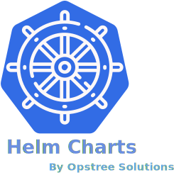

<p align="center">
  
</p>

A helm repository that has a variety of helm charts for helping people to deploy stack inside Kubernetes cluster with best and security practices. One of the main motives of creating these charts is that person can easily deploy the stack or application inside the Kubernetes cluster without getting into the complexity.

[Helm](https://helm.sh/) must be installed to use the charts. Please refer to Helm's [documentation](https://helm.sh/docs/) to get started.

Once Helm is set up properly, add the repo as follows:

```shell
helm repo add ot-helm https://ot-container-kit.github.io/helm-charts
```

You can then run `helm search repo ot-helm` to see the charts.

### Helm Charts List

Currently supported helm charts are:-

- [Redis Operator](./charts/redis-operator)
- [Redis Standalone](./charts/redis)
- [Redis Cluster](./charts/redis-cluster)
- [K8s Vault Webhook](./charts/k8s-vault-webhook)

### Pre-Requisities

- Kubernetes `>=1.15.X`
- Helm `>=3.0.X`

### Installing Helm

Helm is a tool for managing Kubernetes charts. Charts are packages of pre-configured Kubernetes resources.

To install Helm, refer to the [Helm install guide](https://github.com/helm/helm#install) and ensure that the helm binary is in the PATH of your shell.

### Adding Repo

```shell
helm repo add ot-helm https://ot-container-kit.github.io/helm-charts
```

Please refer to the [Quick Start guide](https://helm.sh/docs/intro/quickstart/) if you wish to get running in just a few commands, otherwise the [Using Helm Guide](https://helm.sh/docs/intro/using_helm/) provides detailed instructions on how to use the Helm client to manage packages on your Kubernetes cluster.

Useful Helm Client Commands:

- View available charts: `helm search repo`
- Install a chart: `helm install my-release ot-helm/<package-name>`
- Upgrade your application: `helm upgrade`

## Contact Information

This project is managed by [OpsTree Solutions](http://opstree.com). For any queries or suggestions, you can reach out to us at [opensource@opstree.com](mailto:opensource@opstree.com).

Join our Slack Channel: [#redis-operator](https://opstree.slack.com/archives/C05MBRB50JG).
