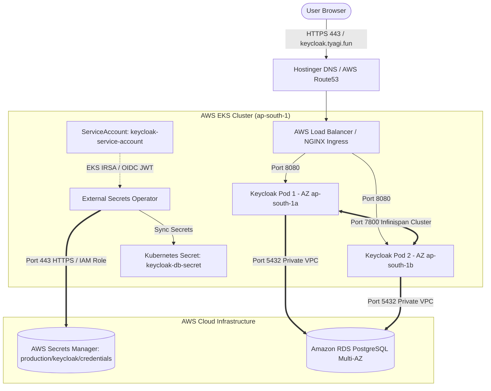

# Keycloak Enterprise Production Helm Chart on AWS EKS

Production-ready, zero-trust Helm chart for deploying Keycloak 26.x (Quarkus distribution) on AWS EKS with Amazon RDS PostgreSQL Multi-AZ, AWS Secrets Manager, and Infinispan High Availability Session Clustering.

---

## Architecture Flow



---

## Enterprise Security Highlights

- **Zero Hardcoded Secrets:** No DB or admin credentials stored in Git or Helm values. Synced dynamically via AWS Secrets Manager & External Secrets Operator (ESO).
- **AWS EKS IRSA (IAM Roles for Service Accounts):** Passwordless AWS API authentication using short-lived OIDC JWT tokens (KeycloakSecretsManagerRole).
- **Pod Firewalling (Zero-Trust):** Amazon VPC CNI eBPF NetworkPolicy restricting pod ingress (ports 8080, 9000, 7800) and egress exclusively to RDS (5432) and AWS APIs (443).
- **Non-Root Execution:** Hardened container running with unprivileged UID 1000 and privilege escalation disabled.
- **High Availability (HA):** Multi-AZ pod anti-affinity, Infinispan cross-pod session clustering, HPA (autoscaling 2-5 pods), and Pod Disruption Budget (minAvailable: 1).

---

## Prerequisites

Before deploying the Helm chart, ensure the following infrastructure is provisioned:

1. **Amazon RDS PostgreSQL (Multi-AZ):** Running in your EKS VPC.
2. **AWS Secrets Manager Secret:** Secret `production/keycloak/credentials` in `ap-south-1` containing keys `db-host`, `db-password`, and `admin-password`.
3. **AWS EKS IRSA IAM Role:** IAM Role `KeycloakSecretsManagerRole` attached to `keycloak:keycloak-service-account` with `SecretsManagerReadWrite` policy.
4. **ZeroSSL TLS Secret:** Created in namespace `keycloak`:
   ```bash
   kubectl create secret tls keycloak-tls-secret --cert=fullchain.pem --key=private.key -n keycloak
   ```

---

## Quick Start Deployment

Deploy Keycloak to your EKS cluster with a single command:

```bash
# Deploy or Upgrade Keycloak Release
helm upgrade --install keycloak ./chart \
  --namespace keycloak \
  --create-namespace
```

---

## Verification & Monitoring

```bash
# Check Pod Status (2 replicas Running across Multi-AZ nodes)
kubectl get pods -n keycloak

# Verify ExternalSecret Sync Status
kubectl get externalsecret -n keycloak

# Check HPA & Pod Disruption Budget
kubectl get hpa,pdb -n keycloak

# Stream Keycloak Boot Logs
kubectl logs -f -l app.kubernetes.io/name=keycloak -n keycloak
```

---

## Access Keycloak Admin Console

Once DNS propagation completes:
- **URL:** `https://keycloak.tyagi.fun/admin`
