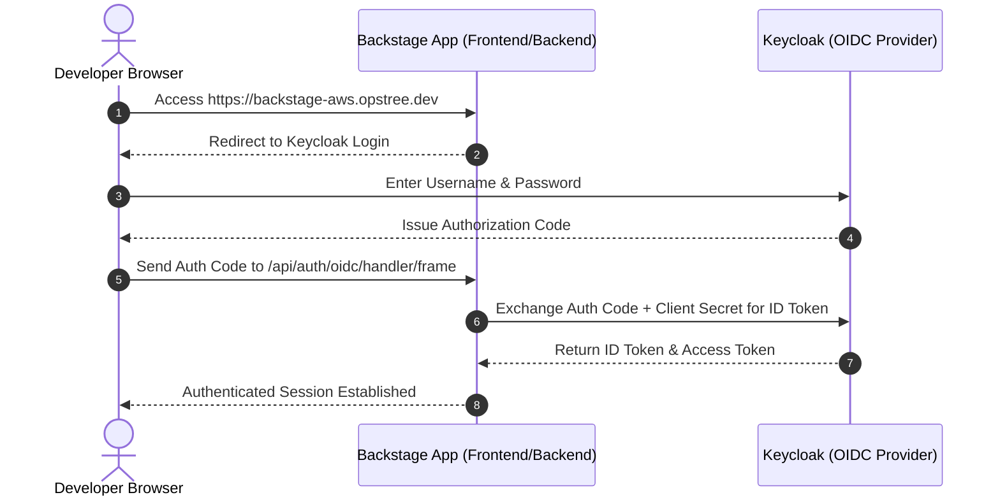

# Keycloak & Backstage Integration Guide (OIDC Single Sign-On)

This guide provides a step-by-step walkthrough to configure **Keycloak 26.x** as the OpenID Connect (OIDC) Single Sign-On (SSO) Identity Provider for **Backstage**.

---

## Architecture Flow



---

## Step 1: Configure Keycloak Admin Console

### 1.1 Log in to Keycloak
1. Open your browser and navigate to: `https://keycloak-aws.opstree.dev/admin`
2. Log in using your admin credentials.

### 1.2 Create a Realm (Optional / Recommended)
1. Click the dropdown in the top-left corner (default is `master`).
2. Click **Create Realm**.
3. Set **Realm name**: `internal` (or `opstree`).
4. Click **Create**.

### 1.3 Create the Backstage OIDC Client
1. In the left sidebar, click **Clients**.
2. Click **Create client**.
3. **General Settings:**
   * **Client type:** `OpenID Connect`
   * **Client ID:** `backstage`
   * Click **Next**.
4. **Capability Config:**
   * **Client authentication:** `ON` (Confidential Client)
   * **Authorization:** `OFF`
   * **Authentication flow:** Check **Standard flow** (Authorization Code) and **Direct access grants**.
   * Click **Next**.
5. **Login Settings:**
   * **Root URL:** `https://backstage-aws.opstree.dev`
   * **Home URL:** `https://backstage-aws.opstree.dev`
   * **Valid redirect URIs:**
     ```text
     https://backstage-aws.opstree.dev/api/auth/oidc/handler/frame
     http://localhost:7007/api/auth/oidc/handler/frame
     ```
   * **Web origins:**
     ```text
     https://backstage-aws.opstree.dev
     http://localhost:7007
     ```
6. Click **Save**.

### 1.4 Retrieve Client Secret
1. Select the `backstage` client you just created.
2. Click the **Credentials** tab.
3. Copy the **Client Secret** value (e.g. `xX79aB...`). Save this for Step 2.

### 1.5 Create a Test User in Keycloak
1. In the left sidebar, click **Users**.
2. Click **Add user**.
3. Set **Username:** `developer`
4. Set **Email:** `developer@opstree.dev`
5. Set **First name:** `John`, **Last name:** `Doe`.
6. Click **Create**.
7. Click the **Credentials** tab for this user.
8. Click **Set password**. Enter a password (e.g., `Password123!`), turn **Temporary** `OFF`, and click **Save**.

---

## Step 2: Configure Backstage (`app-config.production.yaml`)

Update your Backstage configuration file (`app-config.production.yaml`) to enable the OIDC authentication provider:

```yaml
auth:
  environment: production
  providers:
    oidc:
      production:
        metadataUrl: https://keycloak-aws.opstree.dev/realms/internal/.well-known/openid-configuration
        clientId: ${AUTH_KEYCLOAK_CLIENT_ID}
        clientSecret: ${AUTH_KEYCLOAK_CLIENT_SECRET}
        prompt: auto
        signIn:
          resolvers:
            - resolver: emailMatchingUserEntityAnnotation
            - resolver: emailLocalPartMatchingUserEntityName
            - resolver: preferredUsernameMatchingUserEntityAuthId
```

---

## Step 3: Enable OIDC Sign-In in Backstage Frontend (`App.tsx`)

In your Backstage frontend source file (`packages/app/src/App.tsx`), update the `SignInPage` component:

```tsx
import { oidcAuthApiRef } from '@backstage/core-plugin-api';
import { SignInPage } from '@backstage/core-components';

const app = createApp({
  components: {
    SignInPage: props => (
      <SignInPage
        {...props}
        auto
        provider={{
          id: 'oidc',
          title: 'Keycloak Single Sign-On',
          message: 'Sign in with your Keycloak Account',
          apiRef: oidcAuthApiRef,
        }}
      />
    ),
  },
  // ...
});
```

---

## Step 4: Inject Environment Variables & Deploy

Ensure the environment variables are passed to Backstage (via Kubernetes Secret or Helm values):

```yaml
AUTH_KEYCLOAK_CLIENT_ID: "backstage"
AUTH_KEYCLOAK_CLIENT_SECRET: "<PASTE_CLIENT_SECRET_FROM_STEP_1.4>"
```

### Deploy / Upgrade Backstage Release
```bash
helm upgrade --install backstage ./helm/backstage --namespace backstage --create-namespace
```

---

## Step 5: Verification

1. Open browser to `https://backstage-aws.opstree.dev`.
2. You will be greeted with the **Keycloak Single Sign-On** button.
3. Click **Sign in**. You will be redirected to Keycloak.
4. Log in with `developer` / `Password123!`.
5. Upon successful authentication, you will be redirected back into Backstage with an active session!
