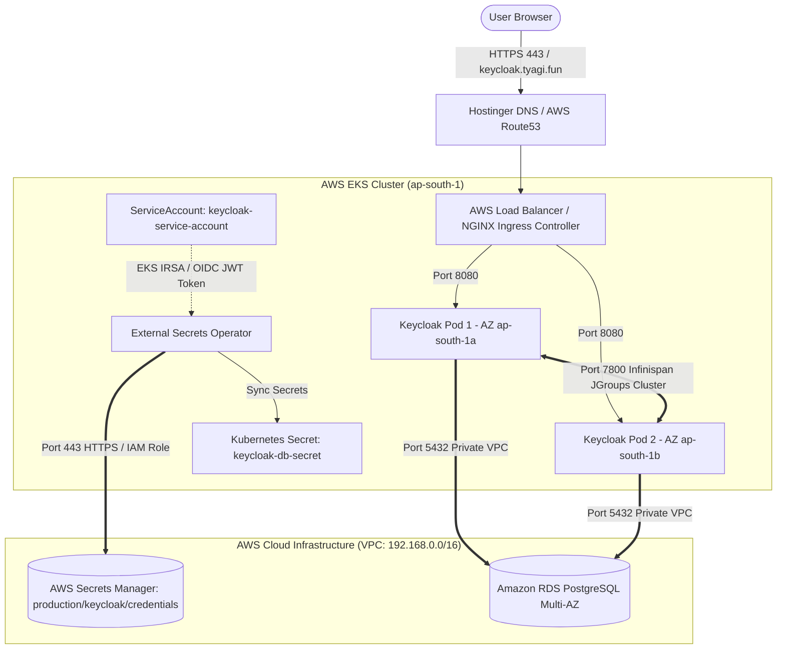
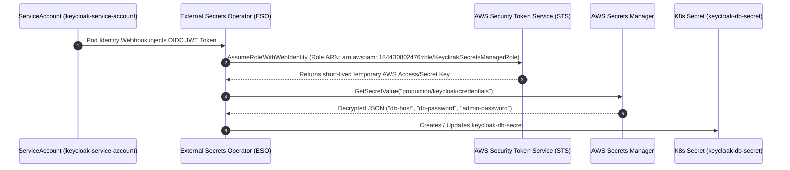

# Keycloak Enterprise High-Level & Low-Level Design (HLD / LLD) Document

---

## 🏛️ Part 1: High-Level Design (HLD)

### 1.1 Executive Overview & Architectural Objectives
This document details the High-Level Design (HLD) and Low-Level Design (LLD) for deploying **Keycloak 26.x (Quarkus distribution)** in a high-availability, zero-trust enterprise production environment on **AWS EKS** in region `ap-south-1`.

Key Objectives:
- **Zero-Trust Identity Governance:** Zero static credentials in code or cluster. Authentication powered by AWS EKS IRSA (IAM Roles for Service Accounts) and AWS Secrets Manager.
- **High Availability & Fault Tolerance:** Multi-AZ Amazon RDS PostgreSQL database replication paired with active-active Infinispan pod session clustering.
- **Zero Downtime Operations:** Controlled rolling update strategy (`maxSurge: 0`, `maxUnavailable: 1`) backed by Pod Disruption Budgets (`minAvailable: 1`).

---

### 1.2 High-Level Architecture Diagram (HLD)



---

### 1.3 High-Level Component Breakdown

| Layer | Technology Stack | HLD Responsibility |
| :--- | :--- | :--- |
| **DNS & Routing** | Hostinger CNAME + NGINX Ingress | External HTTPS termination (`keycloak.tyagi.fun`) and TLS Offloading via ZeroSSL certificates. |
| **Compute / Orchestration** | AWS EKS (v1.28+) | Managed Kubernetes cluster running worker nodes across 2 Availability Zones (`ap-south-1a`, `ap-south-1b`). |
| **Identity Engine** | Keycloak 26.x (Quarkus) | Containerized authentication engine executing as unprivileged non-root user (UID 1000). |
| **Session Cache** | Infinispan + JGroups TCP | Active-active cross-pod user session replication over TCP port 7800 with auto-rebalancing. |
| **Database** | Amazon RDS PostgreSQL 16.x | Multi-AZ database cluster providing synchronous block-level replication and automated failover. |
| **Secrets & IAM** | AWS Secrets Manager + ESO + IRSA | Passwordless credential management syncing `db-host`, `db-password`, and `admin-password` into Kubernetes. |
| **Pod Security** | Amazon VPC CNI eBPF | Stateful ingress/egress NetworkPolicy firewall rules restricting cluster traffic. |

---

## 🔬 Part 2: Low-Level Design (LLD)

### 2.1 Network Topography & Subnet Allocation (VPC: 192.168.0.0/16)

```text
VPC: 192.168.0.0/16 (Region: ap-south-1)
├── Public Subnets (Internet Facing)
│   ├── ap-south-1a: 192.168.1.0/24  --> AWS Load Balancer (ELB) / NAT Gateway 1
│   └── ap-south-1b: 192.168.2.0/24  --> NAT Gateway 2
│
└── Private Subnets (Isolated Workloads)
    ├── ap-south-1a: 192.168.60.0/24 --> EKS Worker Node 1 (Keycloak Pod 1)
    ├── ap-south-1b: 192.168.61.0/24 --> EKS Worker Node 2 (Keycloak Pod 2)
    └── ap-south-1c: 192.168.62.0/24 --> RDS PostgreSQL Subnet 3 (Multi-AZ Replica)
```

---

### 2.2 Low-Level NetworkPolicy & Security Group Matrix

#### A. Amazon VPC Security Group (`keycloak-db-sg`)
- **Group ID:** `sg-048b02a49f974e638`
- **Inbound Rules:**
  - `Protocol`: TCP | `Port`: 5432 | `Source`: `192.168.0.0/16` (EKS Private VPC CIDR Only)
- **Outbound Rules:**
  - Restricted to VPC internal routing.

#### B. Kubernetes NetworkPolicy Matrix (`chart/templates/networkpolicy.yaml`)

```yaml
spec:
  podSelector:
    matchLabels:
      app.kubernetes.io/name: keycloak
  policyTypes:
    - Ingress
    - Egress
  ingress:
    # 1. Traffic from NGINX Ingress
    - from:
        - namespaceSelector: {}
      ports:
        - protocol: TCP
          port: 8080   # Keycloak HTTP
        - protocol: TCP
          port: 9000   # Quarkus Health & Metrics
    # 2. Inter-pod JGroups Session Replication
    - from:
        - podSelector:
            matchLabels:
              app.kubernetes.io/name: keycloak
      ports:
        - protocol: TCP
          port: 7800   # JGroups Infinispan Clustering
  egress:
    # 1. PostgreSQL Database Access
    - ports:
        - protocol: TCP
          port: 5432
    # 2. CoreDNS Resolution
    - ports:
        - protocol: UDP
          port: 53
        - protocol: TCP
          port: 53
    # 3. AWS Secrets Manager & STS APIs
    - ports:
        - protocol: TCP
          port: 443
```

---

### 2.3 Secret Synchronization Protocol (IRSA + ESO + STS)



---

### 2.4 Detailed Container Runtime & Deployment Specifications

#### A. SecurityContext (Non-Root Execution)
```yaml
securityContext:
  runAsNonRoot: true
  runAsUser: 1000
  runAsGroup: 1000
  fsGroup: 1000
```

#### B. Resource Allocations & Scaling Specs
```yaml
# Container Resource Requests & Limits
resources:
  limits:
    cpu: 1000m
    memory: 1024Mi
  requests:
    cpu: 250m
    memory: 512Mi

# Horizontal Pod Autoscaler (HPA)
hpa:
  minReplicas: 2
  maxReplicas: 5
  targetCPUUtilizationPercentage: 75
  targetMemoryUtilizationPercentage: 80

# Pod Disruption Budget (PDB)
pdb:
  minAvailable: 1
```

#### C. Zero-Downtime Rolling Update Strategy
```yaml
strategy:
  type: RollingUpdate
  rollingUpdate:
    maxSurge: 0
    maxUnavailable: 1
```
*Design Rationale:* `maxSurge: 0` prevents cluster capacity exhaustion on 2-node worker groups. `maxUnavailable: 1` ensures 1 pod remains 100% active to serve live requests while the secondary pod updates.

---

### 2.5 Keycloak Quarkus Environment Variable Mapping

| Environment Variable | Source | LLD Purpose |
| :--- | :--- | :--- |
| `KC_DB` | Static (`postgres`) | Sets PostgreSQL database driver. |
| `KC_DB_URL_HOST` | `keycloak-db-secret` (`db-host`) | Dynamically injected RDS endpoint. |
| `KC_DB_URL` | Interpolated string | `jdbc:postgresql://$(KC_DB_URL_HOST):5432/keycloak` |
| `KC_DB_USERNAME` | Static (`keycloak`) | Database application user. |
| `KC_DB_PASSWORD` | `keycloak-db-secret` (`password`) | Dynamically injected database password. |
| `KEYCLOAK_ADMIN` | Static (`admin`) | Master realm superuser username. |
| `KEYCLOAK_ADMIN_PASSWORD` | `keycloak-db-secret` (`admin-password`) | Master realm superuser password. |
| `KC_HOSTNAME` | Values (`keycloak.tyagi.fun`) | Enforces strict canonical URL validation. |
| `KC_PROXY_HEADERS` | Static (`xforwarded`) | Configures Quarkus to trust `X-Forwarded-*` headers from NGINX. |
| `KC_CACHE_STACK` | Static (`kubernetes`) | Enables DNS-based Infinispan pod discovery. |
| `JAVA_OPTS_APPEND` | Interpolated string | `-Djgroups.dns.query=keycloak-headless.keycloak.svc.cluster.local` |

---

### 2.6 Deliverable Matrix & Artifact References

| Deliverable Item | File Location / Reference | Verification Command |
| :--- | :--- | :--- |
| **Helm Production Configuration** | [`chart/values.yaml`](file:///c:/Users/lenovo/OneDrive/Desktop/Keycloak/chart/values.yaml) | `helm lint ./chart` |
| **Keycloak Deployment Spec** | [`chart/templates/deployment.yaml`](file:///c:/Users/lenovo/OneDrive/Desktop/Keycloak/chart/templates/deployment.yaml) | `kubectl get deployment keycloak -o yaml` |
| **Ingress & TLS Definition** | [`chart/templates/ingress.yaml`](file:///c:/Users/lenovo/OneDrive/Desktop/Keycloak/chart/templates/ingress.yaml) | `kubectl get ingress -n keycloak` |
| **AWS ESO Manifest** | [`chart/templates/externalsecret.yaml`](file:///c:/Users/lenovo/OneDrive/Desktop/Keycloak/chart/templates/externalsecret.yaml) | `kubectl get externalsecret -n keycloak` |
| **EKS IRSA ServiceAccount** | [`chart/templates/serviceaccount.yaml`](file:///c:/Users/lenovo/OneDrive/Desktop/Keycloak/chart/templates/serviceaccount.yaml) | `kubectl describe sa keycloak-service-account -n keycloak` |
| **Pod Firewall (eBPF)** | [`chart/templates/networkpolicy.yaml`](file:///c:/Users/lenovo/OneDrive/Desktop/Keycloak/chart/templates/networkpolicy.yaml) | `kubectl get networkpolicy -n keycloak` |
| **Autoscaling & Reliability** | [`chart/templates/hpa.yaml`](file:///c:/Users/lenovo/OneDrive/Desktop/Keycloak/chart/templates/hpa.yaml), [`pdb.yaml`](file:///c:/Users/lenovo/OneDrive/Desktop/Keycloak/chart/templates/pdb.yaml) | `kubectl get hpa,pdb -n keycloak` |
