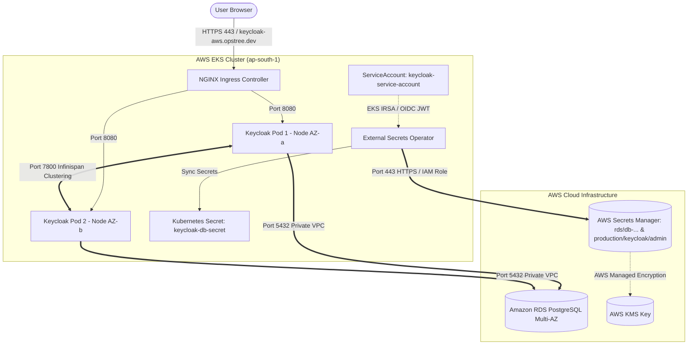

# Keycloak 26.x Production Helm Chart on AWS EKS

Production-ready, zero-trust Helm chart for deploying Keycloak 26.x (Quarkus distribution) on AWS EKS with Amazon RDS PostgreSQL Multi-AZ, AWS Secrets Manager, and Infinispan High Availability Session Clustering.

---

## Architecture Flow



---

## Enterprise Security & Architecture Highlights

- **Zero Hardcoded Secrets:** DB and admin credentials synced dynamically via AWS Secrets Manager & External Secrets Operator (ESO).
- **AWS EKS IRSA (IAM Roles for Service Accounts):** Passwordless AWS API authentication using short-lived OIDC JWT tokens (`KeycloakSecretsManagerRole`).
- **High Availability (HA):** Multi-AZ pod anti-affinity, Infinispan cross-pod session clustering, HPA (autoscaling 2-5 pods), and Pod Disruption Budget (`minAvailable: 1`).
- **Tainted Worker Pool Support:** Pre-configured with node tolerations for `dedicated=application:NoSchedule` and `dedicated=database:NoSchedule`.

---

## Quick Deployment Reference

### 1. Prerequisites
Ensure the following are provisioned before running Helm:
1. **Amazon RDS PostgreSQL Instance** with database `keycloak` created.
2. **AWS Secrets Manager Secrets** for RDS credentials and admin password (`production/keycloak/admin`).
3. **AWS IAM IRSA Role** `KeycloakSecretsManagerRole` attached to `keycloak:keycloak-service-account`.
4. **TLS Secret** in namespace `keycloak`:
   ```bash
   kubectl create secret tls keycloak-tls-secret --cert=fullchain.pem --key=privkey.pem -n keycloak
   ```

### 2. Deploy Helm Chart

```bash
helm upgrade --install keycloak ./chart \
  --namespace keycloak \
  --create-namespace
```

---

## Deployment Verification

```bash
# Check Pod Status (2 replicas Running across Multi-AZ nodes)
kubectl get pods -n keycloak

# Verify ExternalSecret Sync Status (Must show SecretSynced = True)
kubectl get externalsecret,secret -n keycloak

# Check HPA & Pod Disruption Budget
kubectl get hpa,pdb -n keycloak

# Stream Keycloak Boot Logs
kubectl logs -f deployment/keycloak -n keycloak
```

---

## Deployment Documentation Guides

Detailed step-by-step documentation for specific workflows:
* **[Generic Production Deployment Guide](file:///c:/Users/lenovo/OneDrive/Desktop/Keycloak/KEYCLOAK_PRODUCTION_DEPLOYMENT_GENERIC_GUIDE.md):** Complete blueprint for deploying on any new EKS cluster or RDS instance.
* **[Keycloak & Backstage Integration Guide](file:///c:/Users/lenovo/OneDrive/Desktop/Keycloak/KEYCLOAK_BACKSTAGE_INTEGRATION_GUIDE.md):** Step-by-step setup to configure Keycloak OIDC Single Sign-On for Backstage.
* **[Troubleshooting Runbook](file:///c:/Users/lenovo/OneDrive/Desktop/Keycloak/KEYCLOAK_TROUBLESHOOTING_GUIDE.md):** Exhaustive post-mortem of resolved issues and root cause analysis.
